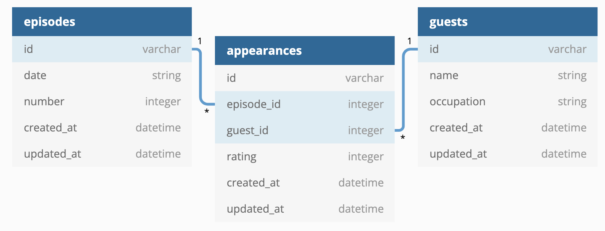

# Flask Code Challenge - Late Show

For this assessment, you'll be working with Late Night TV show domain.

In this repo, there is a Flask application with some features built out. There
is also a fully built React frontend application, so you can test if your API is
working.

Your job is to build out the Flask API to add the functionality described in the
deliverables below.

## Setup

To download the dependencies for the frontend and backend, run:

```sh
pipenv install
npm install --prefix client
```

There is some starter code in the `app/seed.py` file so that once you've
generated the models, you'll be able to create data to test your application.

You can run your Flask API on [`localhost:5555`](http://localhost:5555) by running:

```sh
python app.py
```

You can run your React app on [`localhost:4000`](http://localhost:4000) by running:

```sh
npm start --prefix client
```

You are not being assessed on React, and you don't have to update any of the React
code; the frontend code is available just so that you can test out the behavior
of your API in a realistic setting.

There are also tests included which you can run using `pytest -x` to check your work.

Depending on your preference, you can either check your progress by:

- Running `pytest -x` and seeing if your code passes the tests
- Running the React application in the browser and interacting with the API via
  the frontend
- Running the Flask server and using Postman to make requests

## Models

The application keeps track of the guests that have appeared on the show.

There are three models in the domain: `Guest`, `Episode`, and `Appearance`.

You need to create the following relationships:

- An `Episode` has many `Guest`s through `Appearance`
- A `Guest` has many `Episode`s through `Appearance`
- An `Appearance` belongs to a `Guest` and belongs to an `Episode`

Start by creating the models and migrations for the following database tables:



Add any code needed in the model files to establish the relationships.

Then, run the migrations and seed file:

```sh
flask db revision --autogenerate -m'message'
flask db upgrade
python app/seed.py
```

> Note that this seed file uses a CSV file to populate the database. If you
> aren't able to get the provided seed file working, you are welcome to generate
> your own seed data to test the application.

## Validations

Add validations to the `Appearance` model:

- must have a `rating` between 1 and 5 (inclusive - 1 and 5 are okay)

## Routes

Set up the following routes. Make sure to return JSON data in the format
specified along with the appropriate HTTP verb.

### GET /episodes

Return JSON data in the format below:

```json
[
  {
    "id": 1,
    "date": "1/11/99",
    "number": 1
  },
  {
    "id": 2,
    "date": "1/12/99",
    "number": 2
  }
]
```

### GET /episodes/:id

If the `Episode` exists, return JSON data in the format below:

```json
{
  "id": 100,
  "date": "9/30/99",
  "number": 100,
  "guests": [
    {
      "id": 122,
      "name": "Bruce McCulloch",
      "occupation": "actor"
    },
    {
      "id": 123,
      "name": "Mark McKinney",
      "occupation": "actor"
    }
  ]
}
```

If the `Episode` does not exist, return the following JSON data, along with the
appropriate HTTP status code:

```json
{
  "error": "Episode not found"
}
```

### DELETE /episodes/:id

If the `Episode` exists, it should be removed from the database, along with any
`Appearance`s that are associated with it (an `Appearance` belongs to an
`Episode`, so you need to delete the `Appearance`s before the `Episode` can be
deleted).

After deleting the `Episode`, return an _empty_ response body, along with the
appropriate HTTP status code.

If the `Episode` does not exist, return the following JSON data, along with the
appropriate HTTP status code:

```json
{
  "error": "Episode not found"
}
```

### GET /guests

Return JSON data in the format below:

```json
[
  {
    "id": 122,
    "name": "Bruce McCulloch",
    "occupation": "actor"
  },
  {
    "id": 123,
    "name": "Mark McKinney",
    "occupation": "actor"
  }
]
```

### POST /appearances

This route should create a new `Appearance` that is associated with an existing
`Episode` and `Guest`. It should accept an object with the following properties
in the body of the request:

```json
{
  "rating": 5,
  "episode_id": 100,
  "guest_id": 123
}
```

If the `Appearance` is created successfully, send back a response with the
following data:

```json
{
  "id": 1,
  "rating": 5,
  "episode": {
    "id": 100,
    "date": "9/30/99",
    "number": 100
  },
  "guest": {
    "id": 123,
    "name": "Mark McKinney",
    "occupation": "actor"
  }
}
```

If the `Appearance` is **not** created successfully, return the following JSON
data, along with the appropriate HTTP status code:

```json
{
  "errors": ["validation errors"]
}
```
